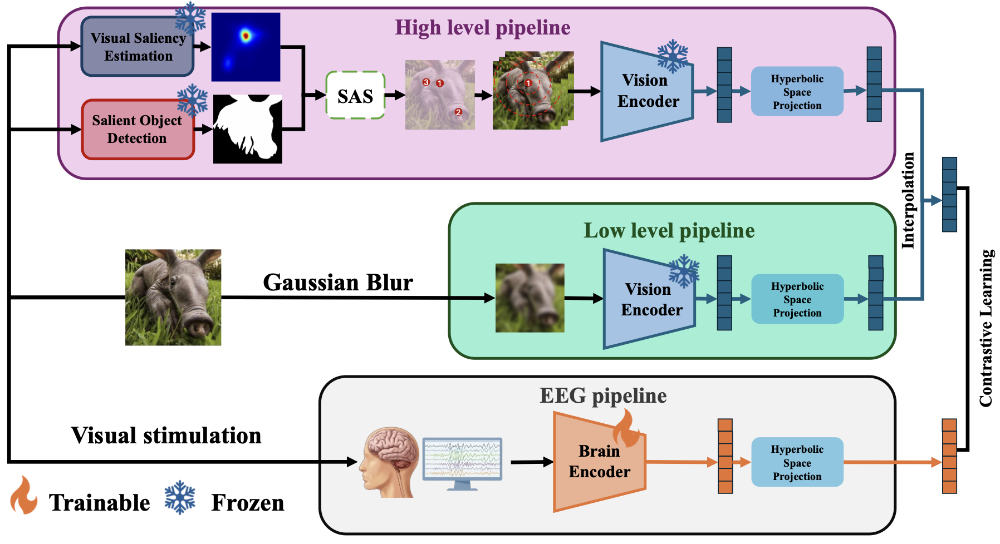

# SIMON: Saliency-aware Integrative Multi-view Object-centric Neural Decoding

**Authors:** YuSheng Lin, Ji-Hua Tsai, Chun-Shu Wei

> **TL;DR:** Saliency-weighted multi-fixation views yield cleaner object-centric visual embeddings, enabling stronger EEG–image alignment and better retrieval than prior SOTA.

This repository contains the official PyTorch implementation of the paper **"SIMON: Saliency-aware Integrative Multi-view Object-centric Neural Decoding"**.

## 📄 Abstract

Recent EEG-to-image retrieval methods incorporate foveated or blurred visual priors but often assume a fixed, center-focused view, mismatching human attention that prioritizes semantically salient regions. We propose **SIMON**, a saliency-aware multi-view visual encoding framework for zero-shot EEG-to-image retrieval. SIMON estimates salient foreground structure, selects multiple fixation centers via saliency-weighted farthest point sampling, and generates foveated views that are encoded and aggregated into a robust semantic representation. We align these visual features with EEG embeddings in a shared hyperbolic space using a contrastive objective with geodesic interpolation.

## 🧠 Framework Overview

<p align="center">
  
</p>

Overview of the proposed SIMON framework. The high-level pipeline extracts saliency-aware multi-view object-centric visual representations, the low-level pipeline captures blurred visual structure, and the EEG pipeline aligns neural responses with visual embeddings through contrastive learning.

## 📚 Citation

If you find this repository or our work useful, please consider citing our paper:

```bibtex
@article{lin2026simon,
  title   = {SIMON: Saliency-aware Integrative Multi-view Object-centric Neural Decoding},
  author  = {Lin, YuSheng and Tsai, Ji-Hua and Wei, Chun-Shu},
  journal = {arXiv preprint arXiv:2605.00401},
  year    = {2026}
}
```

## 📂 Project Structure

    SIMON/
    ├── base/                 # Core definitions (EEG encoder, Data loaders, Hyperbolic utils)
    ├── configs/              # Configuration files
    │   └── SIMON.yaml        # Main hyperparameters
    ├── image_feature/        # Directory for generated semantic embeddings (.pt files)
    ├── preprocess/           # Preprocessing scripts
    ├── SUM/                  # [External] Saliency Unification Module (MIT License)
    │   ├── net/              # Network architecture for SUM
    │   ├── assets/           # Pre-trained weights for SUM
    │   ├── README_SUM.md     # Original SUM documentation
    │   └── LICENSE           # MIT License for SUM module
    ├── Extract_embedding.py  # Script for saliency-aware feature extraction
    ├── main.py               # Main training script
    ├── run_embedding.sh      # Shell script to run the extraction pipeline
    └── requirements.txt      # Python dependencies

## 🛠️ Setup & Installation

1. **Clone the repository:**
   ```bash
   git clone [https://github.com/simonlink666/SIMON.git](https://github.com/simonlink666/SIMON.git)
   cd SIMON
   ```

2. **Install dependencies:**
   The code requires Python 3.10+. Install the necessary packages using:
   ```bash
   pip install -r requirements.txt
   ```

## 💾 Data Preparation

The project relies on the **THINGS** dataset. Please follow the steps below:

1.  **Download Datasets:**
    * **THINGS-EEG:** Download from the [OSF repository](https://osf.io/3jk45/).
2.  **Directory Setup:**
    Place the downloaded files into your data directory. Ensure the paths match the configuration in `configs/SIMON.yaml`.
3.  **Preprocessing:**
    * You may use standard preprocessed versions available on Hugging Face or refer to standard implementations for `Nice-EEG` related preprocessing.

## 🚀 Usage

The pipeline consists of two main phases: **Feature Extraction** and **Neural Decoding Training**.

### Step 1: Extract Saliency-aware Image Features
Run the embedding script to generate the pre-processed visual features. This step utilizes **BiRefNet** for background segmentation and **SUM** for saliency detection.

```bash
bash run_embedding.sh
```
*Note: This script will automatically download the BiRefNet weights from Hugging Face on the first run.*

**Output:**
This script will generate four essential `.pt` files in the `image_feature/` directory (e.g., `high_level_train.pt`, `low_level_train.pt`, etc.).

### Step 2: Main Training
Once the features are generated, start the main training loop:

```bash
python main.py
```
*Configuration: Hyperparameters can be modified in `configs/SIMON.yaml`.*

## 🧩 Acknowledgements & Third-Party Code

To ensure reproducibility, this project incorporates the following external modules/models:

* **Saliency Unification Module (SUM)**
    * **Usage:** Saliency map generation.
    * **Author:** Alireza Hosseini
    * **Source:** https://github.com/Arhosseini77/SUM (MIT License)
    * **Note:** Included in the `SUM/` directory for self-contained execution.

* **BiRefNet (Bilateral Reference Network)**
    * **Usage:** High-quality background segmentation and alpha matte generation.
    * **Author:** ZhengPeng7
    * **Source:** https://huggingface.co/ZhengPeng7/BiRefNet
    * **Note:** Weights are downloaded automatically via the `transformers` library.
